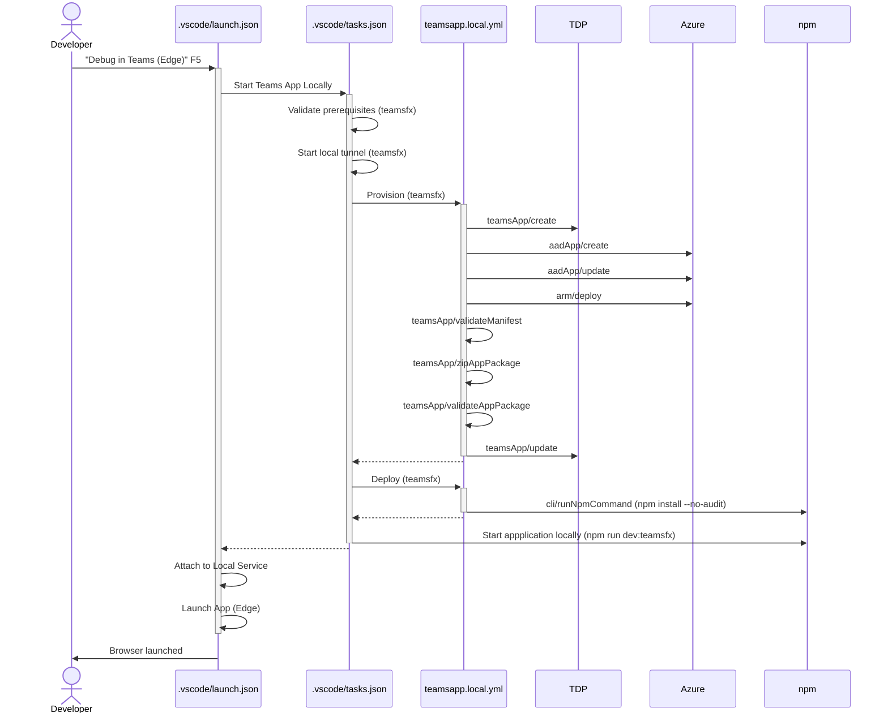

# Teams Toolkit for Visual Studio Code Basic Bot template with SSO, Azure Bot Service and Azure Cosmos DB for local development

This sample extends the out of the box Basic Bot project template in Teams Toolkit for Visual Studio Code and makes the following changes\enhancements:

- Uses `Azure Bot Service` free-tier for local development loop instead of [Microsoft Bot Framework](https://dev.botframework.com/) bot registration
- Uses `Azure Cosmos DB` free-tier account in local development loop to [read/write conversation state to storage](https://learn.microsoft.com/azure/bot-service/bot-builder-howto-v4-storage?view=azure-bot-service-4.0&tabs=javascript#using-cosmos-db) instead of `MemoryStorage`
- Uses `aadApp/create` and `aadApp/update` tasks to create Microsoft Entra ID app registration for Azure Bot Service with app registration manifest in local development
- Uses `arm/deploy` task to update Azure Bot Service during local development, updates messaging endpoint and OAuth connection setting
- Uses [Azure Bot Service Token Service](https://learn.microsoft.com/azure/bot-service/bot-builder-concept-authentication?view=azure-bot-service-4.0#about-the-bot-framework-token-service) to simplify authentication flow
- Uses [Dialogs library](https://learn.microsoft.com/en-us/azure/bot-service/bot-builder-concept-dialog) to obtain access token for Microsoft Graph using OAuthPrompt
- Uses [TeamsSSOTokenExchangeMiddleware]() to handle deduplication in the token exchange step
- Uses linting (ESLint) and formatting (Prettier) rules for code consistency, configured using [GTS](https://github.com/google/gts) (Google TypeScript Style)
- Updated project dependencies to latest major versions (as of November '23)

> ℹ️ This sample goes as far as obtaining a valid access token that can be used to call Microsoft Graph API. This is intentional leaving it open for you as a developer to choose your own path and leave this as un-opinionated as possible.

## Prerequisites

- Teams Toolkit for Visual Studio Code
- Microsoft 365 tenant with [uploading custom apps enabled](https://learn.microsoft.com/microsoftteams/platform/m365-apps/prerequisites#prepare-a-developer-tenant-for-testing)
- Account with access to an active Azure subscription and has permissions to create a resource group

## Get started

- Clone repo
- Open repo in VSCode
- Take a copy of all the files in `env` folder and remove `.sample` from the copies, for example, `.env.local.sample` becomes `.env.local`
- Press `F5`, follow the sign in prompts

> ℹ️ The `arm/deploy` task generates a prompt that you need to confirm to provision or update the Azure Bot Service in Azure. The Azure Bot Service and Azure Cosmos DB are provisioned using the free tiers, so no cost will be incurred.
>
> ⚠️ If you already have an Azure Cosmos DB account that uses the free-tier in your target Azure subscription the provisioning will fail. There is a limitation on one free tier account per Azure subscription.

## Test the bot

Send a message to the bot and an Adaptive Card will be returned with the access token to call Microsoft Graph.

## Manage conversation state

To manage the conversation state saved to Azure Cosmos DB, use the web based [Azure Cosmos DB Explorer](https://cosmos.azure.com/).

## Sequence Diagram for F5

